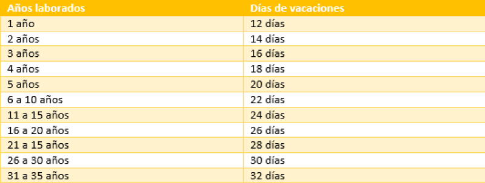

<html>
    <head>
        <meta charset="utf-8">
    </head>
    <body>
        <h1> ¿quieres calcular tu finiquito? </h1>  
       
 si al fin te liberaste de la explotacion laboral y quieres calcular tu parte correspondiente esto te ayudara  
        recuerda ser lo mas especifo y exacto en las cantidades para que tu finiquito sea exacto 

             
 ¿cual es tu salario diario?   si no lo sabes solo divide tu salario mensual entre 30. 

             
 
                 <input type="number" id="sueldo diario">
                
             

             

                ¿cuantos dias de aguinaldo dan en tu empresa?
             

             

                <input type="number" id="diasaguinaldo">
             

             
             

                ¿cuantos meses del año en curso  trabajaste en la empresa?   
                ejemplo: renuncie en noviembre, por lo tanto labore 11 meses de este año 
             

             

                <input type="number" id="mesestrabajados">
             

             

                ¿cuantos dias de vacaciones te corresponden? 
                

                    
                

                <input type="number" id="diasvacaciones">
             

             <button onclick="suma()"> suma</button>
             

            
             

        
    </body>
</html>